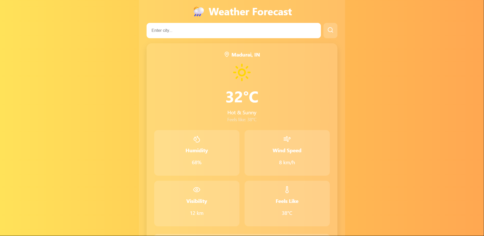

# 🌦️ Weather Forecast App

A modern, responsive Weather Forecast Web App built using **ReactJS**, displaying real-time weather data with **seasonal background themes** and informative weather metric cards.

---

## 📸 Preview

---

## 🚀 Features

- 🔍 **Live City Search** – Instantly fetch weather data by city name
- 🌈 **Dynamic Backgrounds** – Weather-based color themes (sunny, cloudy, rainy)
- 📦 **Weather Cards** – Organized layout for:
  - Temperature 🌡️
  - Feels Like 🤒
  - Humidity 💧
  - Wind Speed 🌬️
  - Visibility 👀
- 📱 **Mobile Responsive** – Seamless experience across all devices
- 🧠 **Seasonal Tips** – Safety or lifestyle advice based on weather

---

## 🛠️ Built With

- [ReactJS](https://reactjs.org/)
- [Vercel](https://vercel.com/) 

---
## 🌐 Live Demo

👉 [Click here to see the live site](https://weather-app-opal-phi-81.vercel.app/)

📄 License
This project is licensed under the MIT License - see the LICENSE file for details.

🙋‍♂️ Author
Muthu Prabhu
📍 Madurai, Tamil Nadu
📧 [E-mail](muthuprabhu2003mp@gmail.com)
🔗 [LinkedIn](www.linkedin.com/in/muthu-prabhu) | [GitHub](https://github.com/Muthuprabhu2003)

